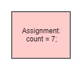
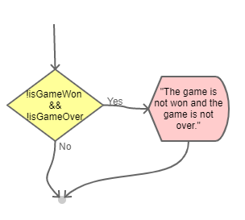

# Coding and Flowchart Examples

- [Coding and Flowchart Examples](#coding-and-flowchart-examples)
  - [Declaring a Variable](#declaring-a-variable)
    - [Code Example](#code-example)
    - [Flowchart Example](#flowchart-example)
  - [Assignment](#assignment)
    - [Code Examples](#code-examples)
    - [Flowchart Examples](#flowchart-examples)
    - [Increment](#increment)
    - [Flowchart Examples](#flowchart-examples-1)
  - [If Statements](#if-statements)
    - [Common mistakes](#common-mistakes)
    - [Code / Flowchart Examples](#code--flowchart-examples)
  - [Else Statements](#else-statements)
    - [Code / Flowchart examples](#code--flowchart-examples-1)
  - [Else-If Statements](#else-if-statements)
    - [Example Code / Flowcharts](#example-code--flowcharts)
  - [For Each Loops](#for-each-loops)
    - [Example Code / Flowcharts](#example-code--flowcharts-1)
  - [Calling a Method](#calling-a-method)
    - [Example Code / Flowcharts](#example-code--flowcharts-2)

## Declaring a Variable

A variable is a named location in computer memory. To declare a variable in C#,
we must specify the type of data being stored as well as the name of the
variable.

### Code Example

```csharp
int count; // Declare an integer named "count"
string guess; // Declare a string named "guess"
List<char> guesses; // Declare a list of characters named "guesses"
```

### Flowchart Example

We use a declaration block in a flowchart to show that we want to create a
variable.


## Assignment

Assignment is an operator in which tells the computer that we would like to
store a value within a variable. In C#, the assignment operator is a binary
operator represented by the `=` symbol.

### Code Examples

```csharp
count = 7; // Assign the value 7 to the variable count
guess = "Hello World"; // Assign the value "Hello World" to the variable guess
```

### Flowchart Examples

Assignment is represented by using a `Process` block with the word `Assignment`
followed by the actual assignment that is taking place.




### Increment

An increment is a special type of assignment that can be performed on number
types. For example:

```csharp
count = count + 1; // Calculate count + 1, then assign the value to the count variable.
```

The above is so common in programming that there is a short hand operator for
incrementing a number variable:

```csharp
count++;
```

### Flowchart Examples

The increment operator is a process block with the work `Increment` followed by
the variable being incremented:


## If Statements

An if statement allows us to use a boolean expression (true/false) to select if
a piece of code should execute. If the boolean expression is false, the code
within the if statement is skipped. If the boolean expression is true, the code
within the if statement is executed. In both situations, the code following the
if statement is then executed. In C#, an if statement must use the following
form:

```csharp
if (bool-expression) // Check if the bool-expression is true
{
    // Code to execute if bool-expression is true
}

// Continue executing here 
```

### Common mistakes

There are two very common mistakes that new programmers make when writing if
statements:

1. An if statement does not have a semi-colon (`;`) at the end of the line.
2. Many new programmers forget to put curly braces `{` and `}` around the body
   of their if statement. This error is incredibly easy to make because the code
   will still compile (no errors).

### Code / Flowchart Examples

```csharp
bool isGameOver = ???; // Assume a variable isGameOver exists and has an unknown value
if (isGameOver) // Checks if isGameOver has a value of true
{
    Console.WriteLine("Game over!");
}
```


```csharp
if (!isGameOver) // Checks if isGameOver has a value of false
{
    Console.WriteLine("The Game is not over!");
}
```


```csharp
bool isGameWon = ???; // Assume a variable isGameWon exists and has an unknown value
if (!isGameWon && !isGameOver) // Checks that the game isGameWon is false and isGameOver is false
{
    Console.WriteLine("The game is not won and the game is not over.");
}
```



```csharp
if (isGameWon || isGameOver) // Checks that the isGameWon is true or isGameOver is true
{
    Console.WriteLine("The game is won or the game is over");
}
```


```csharp
int guess = ???; // Assume a variable guess exists and has an unknown value
if (guess > 100) // Check if the guess variable has a value that is greater than 100.
{
    Console.WriteLine("Your guess was greater than 100.");
}
```


```csharp
if (guess < 0) // Check if the guess variable has a value that is less than 100.
{
    Console.WriteLine("Your guess was less than 0.");
}
```


```csharp
if (!(guess < 0) && !(guess > 100)) // Check if the guess variable has a value that is not less than 0 and not greater than 100
{
    Console.WriteLine("Your guess was between 0 and 100.");
}
```


## Else Statements

An else statement allows us to make a selection that chooses between two
different paths. An else statement is always preceded by an if statement and has
the following form:

```csharp
if (bool-expression)
{
    // If the bool-expression is true
} 
else 
{
    // If the bool-expression was false
}

// Both paths continue executing here.
```

### Code / Flowchart examples

```csharp
if (guess < 0) // Check if the guess variable has a value that is less than 100.
{
    Console.WriteLine("Your guess was less than 0.");
} 
else // The guess was not less than 0 (the expression above is false)
{
    Console.WriteLine("Your guess was greater than or equal to 0.");
}
```


```csharp
if (!(guess < 0) && !(guess > 100)) // Check if the guess variable has a value that is not less than 0 and not greater than 100
{
    Console.WriteLine("Your guess was between 0 and 100.");
} else // If the guess was less than 0 or greater than 100 (the expression above is false)
{
    Console.WriteLine("Your guess was out of bounds!");
}
```


## Else-If Statements

An `else` statement can be followed by another `if` statement. This allows us to
select from many different outcomes. This is often called a decision tree. Here
is a generalized form of this:

```csharp
if (bool-expression-0)
{
    // If the bool-expression-0 is true
} 
else if (bool-expression-1)
{
    // If the bool-expression-0 is false and 
    // If the bool-expression-1 is true
}
else if (bool-expression-2)
{
    // If the bool-expression-0 is false and 
    // If the bool-expression-1 is false and
    // If the bool-expression-2 is true
}
...
else if (bool-expression-n)
{
    // If all previous bool-expressions are false and
    // If the bool-expression-n is true
}
...
else // else is optional 
{
    // If all of the bool-expressions are false
}

// All paths continue executing here.
```

### Example Code / Flowcharts

```csharp
if (guess < 0) // Check if the guess variable has a value that is less than 100.
{
    Console.WriteLine("Your guess was less than 0.");
} 
else if (guess > 100) // If the guess was not less than 0 and the guess is greater than 100
{
    Console.WriteLine("Your guess was greater than 100.");
}
```


```csharp
if (guess < 0) // Check if the guess variable has a value that is less than 100.
{
    Console.WriteLine("Your guess was less than 0.");
} 
else if (guess > 100) // If the guess was not less than 0 and the guess is greater than 100
{
    Console.WriteLine("Your guess was greater than 100.");
}
else
{
    Console.WriteLine("Your guess is in bounds!");
}
```


```csharp
if (guess < 0) // Check if the guess variable has a value that is less than 100.
{
    Console.WriteLine("Your guess was less than 0.");
} 
else if (guess > 100) // If the guess was not less than 0 and the guess is greater than 100
{
    Console.WriteLine("Your guess was greater than 100.");
}
else if (guess == solution)
{
    Console.WriteLine("That's the solution!");
}
```


## For Each Loops

A for each loop allows us to run a piece of code multiple times on a list-like
variable. In C# we write for each loops like this:

```csharp
foreach (variable-declartion in variable)
{
    // Code to execute multiple times
}
// Continue here after the foreach loop is finished
```

### Example Code / Flowcharts

For Each flowcharts are represented using a `Data` block. This is because a
`foreach` loop will always declare a new variable to be used within the loop.
When creating a flowchart, it is typically good practice to put the body of the
loop to the right side of the `Data` block. Additionally, almost all paths
within the body of the loop will lead back to the `Data` block. Finally, the end
of the for each loop typically continues from the bottom of the `Data` block.

```csharp
List<int> guesses = ???; // Assume a variable guesses exists which is a list of integers
int total; // Declare a variable named total to hold the sum of all the guesses.
total = 0; // Initialize total by assigning it the value 0
foreach(int value in guesses) // Declares a variable named value which will represent each integer in the list guesses
{
    total = total + value; // Add value and total together, then assign the sum to total
}
Console.WriteLine($"The sum of guesses is: {total}");
```


```csharp
List<int> guesses = ???; // Assume a variable guesses exists which is a list of integers
int total; // Declare a variable named total to hold the sum of all the guesses.
total = 0; // Initialize total by assigning it the value 0
foreach(int value in guesses) // Declares a variable named value which will represent each integer in the list guesses
{
    if (value > 10) // never add more than 10
    {
        total = total + 10;
    }
    else if (value < 1) // never add less than 1
    {
        total = total + 1;
    }
    else // If the value is between 1 and 10, add the value
    {
        total = total + value;
    }
}
Console.WriteLine($"The sum of guesses is: {total}");
```


## Calling a Method

When we use a method, we refer to this as "calling" a method. The current line
of code is suspended while the method is executed. When the method finishes, we
say that it "returns" to the line of code where it was "called". If a method
returns something, the value is substituted where the call was made. We call
this value the "result" of the call.

### Example Code / Flowcharts

In a flowchart, we use the `Procedure Call` block to represent that there is
another flowchart that is executed. The block immediately following the
procedure call has access to the result of the procedure call. This is typically
represented by placing the text "result" on the arrow exiting the `Procedure
Call` block. 

```csharp
int count; // Declare an integer variable named count
count = this.CountLetter('a'); // Call the CountLetter method passing in 'a' as an argument
Console.WriteLine($"There are {count} As"); // Call the WriteLine method passing $"There are {count} As" as an argument
```


In the example above, it is important to note that the method call
`this.CountLetter('a')` happens before the assignment. This is because we must
first evaluate the method call before we can assign the value to `count`.