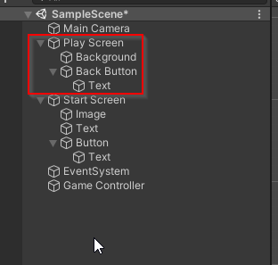

# Milestone 5: First Challenge

- [Milestone 5: First Challenge](#milestone-5-first-challenge)
  - [Before Starting](#before-starting)
  - [First Challenge](#first-challenge)
    - [Adding a Start Screen and Play Screen GameObject](#adding-a-start-screen-and-play-screen-gameobject)
    - [Activating and Deactivating Screens](#activating-and-deactivating-screens)
    - [The Start() method](#the-start-method)
  - [Adding the WordGame Library to your project](#adding-the-wordgame-library-to-your-project)

## Before Starting

Before attempting this challenge, you should complete the [Getting Started](0_GettingStarted.md) 
tutorial.

## First Challenge

In this challenge, you will add several text assets, images, and buttons to your
Scene and create a framework for playing the Snowman Word Guessing Game.

### Adding a Start Screen and Play Screen GameObject

In this section, you will create two Canvases: `Start Screen` and `Play Screen`. The Start Screen
will contain all of the elements you've added thus far. The Play Screen will contain new elements
that will be used while playing the Snowman Word Guessing Game.

1. Rename your `Canvas` GameObject to `Start Screen`
2. Create a new `Canvas` in your hierarchy and name it `Play Screen`
   * `UI` > `Canvas`
3. Update `Play Screen`'s `Render Mode` to `Screen Space - Camera`
4. Set the `Render Camera` to `Main Camera`
5. Set the `Order in Layer` to `1`

When you're done, it should look something like this:

6. Create an image to be the new background for the `Play Screen`
   * You may use any image, including these: [LINK](./backgrounds/) 
7.  Add a `Back` Button to the Play Screen

When you're finished, your hierarchy should look like similar to this:

### Activating and Deactivating Screens

In this section, you will add the `Start Screen` and `Play Screen` GameObjects to your Game Controller script. Then, you will update the `Start` and `Back` buttons to switch between the screens.

You may have noticed that the new screen is either blocking or being blocked by the `Start Screen`. 
Depending on the `Order in Layer` setting. This is because they overlap with each other. To ask Unity to not render a specific Game Object (and all of its children) we can Activate and Deactivate it using the inspector.

In the code, you can activate / deactivate a Game Object using the `SetActive(bool)` method where `true`
will Activate the object and `false` will Deactivate the object.

1. In your `GameController.cs` script, add two public member variables:
   * public GameObject StartScreen
   * public GameObject PlayScreen
2. In Unity, add the appropriate references to the Game Controller Game Object
3. In your `GameController.cs` script, update your `StartGame()` method to deactivate the `Start Screen` GameObject by calling its `SetActive(false)` and activating the `Play Screen` by calling its `SetActive(true)` method.
4. Add a `OpenStartScreen()` method to your `GameController.cs` script. Make this method activate the `Start Screen` and deactivate the `Play Screen`.
5. Update your buttons as needed to call these methods when the buttons are clicked.
6. Make sure your `Play Screen` is set not active and the `Start Screen` is set to active in the Unity Editor.
7. Test your buttons by running your project

Common Mistakes:

 * `UnassignedReferenceException: The variable StartScreen of GameController has not been assigned.`
   * This error is saying you never set the `Start Screen` reference in the Unity Editor
 * I can't find my method in the OnClick settings
   * Is your method set to `public`? Only public methods can be seen in the inspector.
 * My button doesn't work
   * Did you set the OnClick() action?
 * Only one of my buttons works
   * Check to make sure your button's OnClick() method is calling the correct method

### The Start() method

In this section, you will learn about a "Magic" method called `Start()` which, if defined, is executed when a `GameObject` enters a scene. You will use this method to ensure that your `Start Screen` is the only active screen when the game starts.

1. Add a method to your `GameController.cs` file called `Start()`
2. Inside this method, set your `Start Screen` to be active and your `Play Screen` to be deactive.
3. In Unity, set your `Play Screen` as active and your `Start Screen` as deactive.
4. Run your project.
5. If all went well, your `Start Screen` will be active when the project launches.

## Adding the WordGame Library to your project

In the [next section](2_AddingLibrary.md), you will learn how to compile your Word Game project into a library that can be added to your Unity project.
