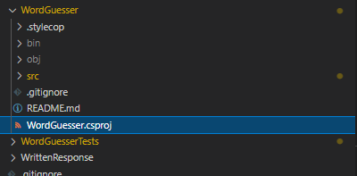
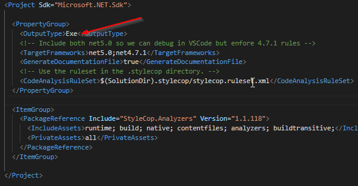
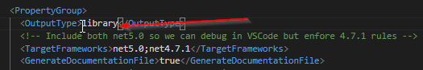
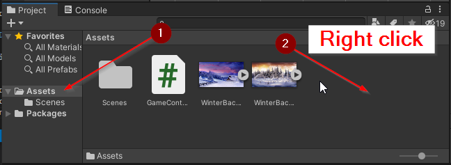
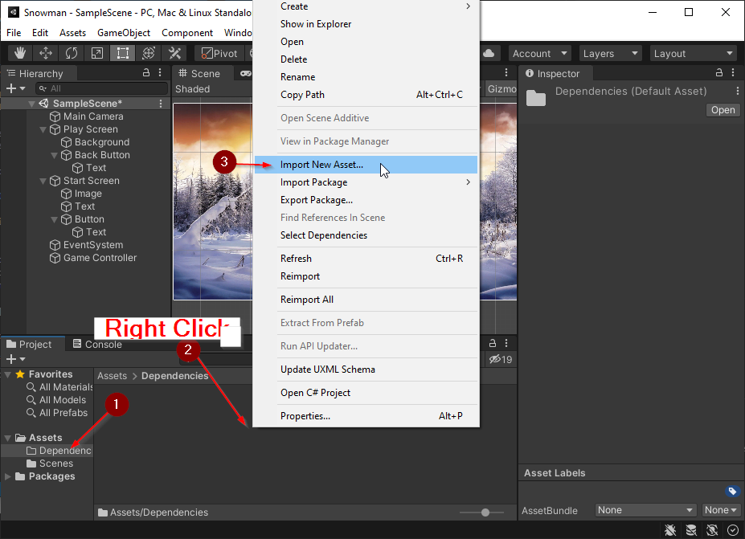
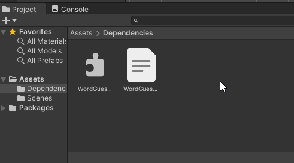
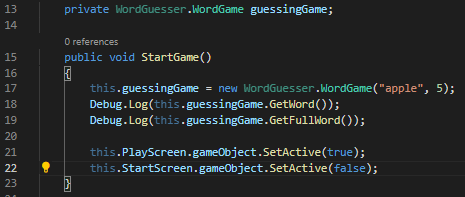
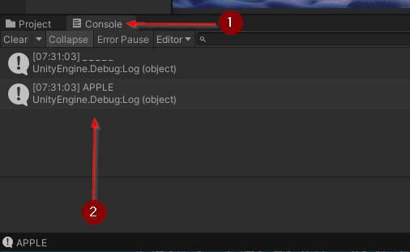

# Milestone 5: Adding the WordGame Library

- [Milestone 5: Adding the WordGame Library](#milestone-5-adding-the-wordgame-library)
  - [Before Starting](#before-starting)
  - [Creating a C# Library](#creating-a-c-library)
  - [Adding a DLL to Unity](#adding-a-dll-to-unity)
    - [Importing a DLL to your Project](#importing-a-dll-to-your-project)
    - [Using the WordGuesser library](#using-the-wordguesser-library)
    - [Importing the `WordGuesser` library](#importing-the-wordguesser-library)
  - [Second Challenge](#second-challenge)

## Before Starting

Before starting this section, you should have completed Milestone 2 of the
Snowman project. Additionally, you should have completed the [First
Challenge](1_FirstChallenge.md).

## Creating a C# Library

In this section, you will learn how to compile a C# project into a library so
that you can add it to a Unity project.

1. Open your completed Snowman project in VS Code
2. Locate the `WordGuesser/WordGuesser.csproj` file.

3. Open the file. 

This file contains information on how to compile and run the WordGuesser
program. Currently, the project is set to run as an `Exe` this stands for
executable. This means that the project can be run using in the terminal by
running `dotnet run` while in the `WordGuesser` directory.

We want to build a library. A library is a set of code which, by itself, does
not run. Instead, it is a module that can be added to any other compatible
project. 

To do this, change the `OutputType` field to be `library`.

4. Save your changes
5. Run the build command
    * `Command + Shift + P` > `Tasks: Run Build Task` > `build`

If all goes well, you will get no red output in your Terminal. If you get red
output, this process failed. Yellow output is okay (just warnings).

In your File explorer, you should now be able to find a folder
`WordGuesser\bin\Debug\net4.7.1` with a `WordGuesser.dll` and a
`WordGuesser.xml` file.

The `dll` file is a "Dynamically Loaded Library" containing your compiled
project. The `xml` file is a file that contains the documentation comments that
were provided with the code.

**Note**: There is also a `net5.0` folder which also contains a library file.
Unity 2020.3 uses .NET 4.7.1 so we created a compatible version.

Congratulations! You now have a library you can add to Unity!

## Adding a DLL to Unity

In this section, you will learn how to add your compiled WordGuesser.dll library
to your Unity project.

### Importing a DLL to your Project

1. Open your Unity Project
2. In the Project window, select the `Assets` folder.
3. Right click inside the `Assets` folder and select `Create` > `Folder`
4. Name the new folder `Dependencies`

5. Open the `Dependencies` folder
6. Right click inside the folder and select `Import New Asset...`
7. Navigate to the `WordGuesser\bin\Debug\net4.7.1` folder within your groups
   Snowman project
8. Add both the `WordGuesser.dll` and the `WordGuesser.xml` files

**Note**: If you can also drag and drop the files from `Finder` (but not
directly from VS Code)

After you add `WordGuesser.dll`, Unity will rebuild your project to include the
library. This may take several moments.

If all goes well, your `Dependencies` directory will look like this:

### Using the WordGuesser library

1. Open your `GameController.cs` script
2. Add a new private `WordGuesser.WordGame` member variable to your
   GameController class
   * `private WordGuesser.WordGame guessingGame;`
3. Update your `StartGame()` method to construct a new WordGame and then assign
   it to your new variable.
   * `this.guessingGame =  new WordGuesser.WordGame("apple", 5);`
4. Add a line of code which outputs a debug message to the console showing the
   results of `GetWord()` and `GetFullWord()` methods.
   * `Debug.Log(this.guessingGame.GetWord());`
   * `Debug.Log(this.guessingGame.GetFullWord());`

5. Return to the Unity Editor and run your program.
6. Click the `Start` button to execute the `StartGame()` method.
7. Open the `Console` window to see the debug messages.

### Importing the `WordGuesser` library

It is pretty annoying to have to prefix everything from the Word Guesser library
with `WordGuesser`.

To remove this restriction, you can import the `WordGuesser` library by adding
the line `using WordGuesser;` at the top of your scripts. Now, you can use
`WordGame` without prefixing it with `WordGuesser`. 

Fun fact: The `UnityEngine.UI` prefix you used previously is also a library you
can import with the `using` keyword.

## Second Challenge

Congratulations, you have compiled a library and added it to your Unity Project.
In the [next section](3_SecondChallenge.md), you will be challenged to finish
the `Play Screen` functionality by using the `WordGame` library.
