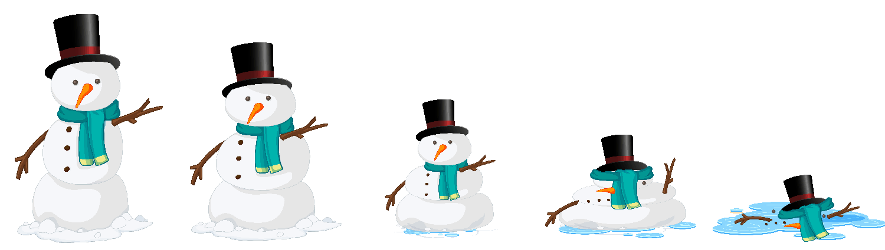

# Milestone 5: Creating the Play Scene

## Before Starting

Before you start this section, you should have completed the [Adding the WordGame Library](2_AddingLibrary.md) tutorial.

## Second Challenge

In this challenge, you will complete the Play Scene by adding several Text components
to display information to the user as well as adding an Input field that
will allow your user to input guesses.

### Add an Input Field and Submit Button

1. Add an Input Field to your `Play Scene`
   *  `UI` > `Input Field`

Notice the `Input Field` has several children components. The two fields of importance for you are:

    * Text - The text the player has entered
    * Placeholder - The text that is displayed when the player has not entered any text

2. Update your Placeholder text to say "Enter a Guess"
3. Add a Button to your `Play Scene`.
4. Set the text of the button to "Submit"
5. Position your elements on the scene in a reasonable way.
6. Add a new `UnityEngine.UI.InputField` to your Game Controller.
    * `public UnityEngine.UI.InputField PlayerGuess`
7. In the Unity Editor, update the Game Controller to reference the scenes Input Field.

### Add a SubmitGuess() method

1. Create a new method in your Game Controller `public void SubmitGuess()`
2. The `InputField` provides a `text` value you can use to read the users input.
3. Read the `PlayerGuess.text` value and call the `CheckGuess` method of your word game.
4. Output the result to the console using `Debug.Log`
5. Clear the InputField by assigning `PlayerGuess.text` to the empty string
    * `PlayerGuess.text = string.Empty`
6. Return to Unity, update the `Submit` button's `OnClick` handler to call the `SubmitGuess()` method 

Test your project by running the code.

### Add Text elements to your Scene to display information to the player

1. Create a Text element to display the hidden letters (`GetWord()`)
2. Create a Text element to display the letters guessed so far (`GetGuessedLetters()`)
3. Create a Text element to display the number of guesses remaining.
4. Create a text element to display information to the user after they've made a guess (`CheckGuess(char guess)`)
5. Add member variables to your Game Controller
6. Update your `SubmitGuess()` method to update the elements appropriately

### Create a Game Over Screen

Create a Game Over screen that is shown when the player runs out of guesses.

1. A Text element displaying a message saying the player lost.
2. A Text element displaying the correct word.
3. A Button to `Play Again` - This should use `StartGame()`

Update your Game Controller to show the Game Over screen when appropriate

### Create a Game Won Screen

Create a Game Won screen that is shown when the player guesses all the letters in the word.

1. A Text element displaying a message saying the player won.
2. A Button to `Play Again`

Update your Game Controller to show the Game Won screen when appropriate

## Advanced Features

To receive a score of Advanced in Computational Thinking, you must complete at least 2 custom features. You may complete the features below OR suggest your own. Any suggested features *MUST* be approved.

1. Utilize the `WordSelector` class to generate random words for your game.
2. Add music (or sounds) to your game: Each screen should have its own music.
3. Add an image representation of your snowman melting as the player makes incorrect guesses. You may use the provide graphics or create your own.
   

4. Add buttons for each possible letter using a for loop (rather than an Input Field).
5. Create an Easy, Medium, and Hard mode.