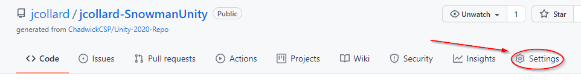
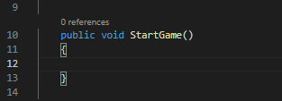

# Milestone 5

- [Milestone 5](#milestone-5)
  - [Before Starting](#before-starting)
  - [Getting Started](#getting-started)
    - [Create a Repository](#create-a-repository)
    - [Create a 2D Unity Project](#create-a-2d-unity-project)
    - [Commit the initial project](#commit-the-initial-project)
    - [Configuring Unity to use VS Code](#configuring-unity-to-use-vs-code)
  - [Unity Basics](#unity-basics)
    - [Overview](#overview)
    - [Specifying the View Port Dimensions](#specifying-the-view-port-dimensions)
    - [Add a Text Element to your Scene](#add-a-text-element-to-your-scene)
    - [Changing the Text Properties](#changing-the-text-properties)
    - [Add a Background Image](#add-a-background-image)
    - [Add a Button](#add-a-button)
    - [Adding a Script](#adding-a-script)
    - [Opening the Script in VS Code](#opening-the-script-in-vs-code)
    - [Adding References to the Scene Elements](#adding-references-to-the-scene-elements)
    - [Writing a StartGame() method](#writing-a-startgame-method)
    - [Running your program](#running-your-program)

## Before Starting

Before starting, you should install Unity Hub and Unity 2020.3. If you are on Mac, you should 
install Mono.

* Unity Hub Mac: [LINK](https://drive.google.com/file/d/1PHnpMFkHKqsxEiO2TEJUjf58BP3tVZNY/view)
* Unity Hub Windows: [LINK](https://unity3d.com/get-unity/download)
* Mono (Mac only): [LINK](https://drive.google.com/file/d/1-szuBcnWh8CILQeJA-2EacNADaW4mxb-/view?usp=sharing)

Installing Unity Instructions: [LINK](../UnitySetup/README.md)

## Getting Started

This milestone is an **individual** activity. Each group member should complete it in their own repository.

### Create a Repository

An almost empty repository template has been provided for you here: [LINK](https://github.com/ChadwickCSP/Unity-2020-Repo)

1. From this page, click the `Use this Template` button.

2. Name the repository `{username}-SnowmanUnity`

3. You **may** make your repository `Private`. This will prevent anyone from seeing the contents of the repository.

4. Finally, click `Create repository from template`. This will take several seconds to complete.

5. Next, you will add Mx. Collard as a contributor. Select the `Settings` tab.

6. Select, `Manage Access` from the left menu.

7. Click, `Add People`

8. Search for `jcollard` and click the `Add` button

9. You're now ready to clone your repository. Follow the usual steps in GitHub Desktop to clone the repository to your computer.

### Create a 2D Unity Project

1. Open Unity Hub
2. Click the `Projects` Tab on the left
3. Click the blue `New` button in the top right  

4. Name the project `Snowman`
5. Use the `2D` Template
6. Click the `...` next to the `Location`.

7. Navigate to the cloned repository. This is usually in `Documents/GitHub/REPO-NAME`
8. Select the folder and click `Create`. Depending on the speed of your computer, it can take a minute or two to initialize the project.

### Commit the initial project

If you go back into GitHub Desktop, you will see there are thousands of files that have been added to your project. You **DO NOT** want to commit all of these. Most of these files can be generated by Unity when a project is loaded.

To track files that should not be added to a repository, we can use a file called `.gitignore`. The Template you started from has a `.gitignore` file that is designed to prevent unnecessary Unity files from being added to a repository. You need to move this file into your Project folder.

1. Open your project repository in VSCode. You will know you're in the right place if you have a folder called `Snowman` a file called `.gitignore` and a `README.md` file.

2. Move the `.gitignore` file inside of the `Snowman` folder.

3. Commit and Push your changes. Note: The image below should be clicking the Add all button not just the add button for `.gitignore`

### Configuring Unity to use VS Code

The last thing we need to do before we can start working with Unity is to configure it to use VS Code as a script editor.

1. Go back to the Unity editor. 
2. Open the `Preferences` Menu.
    * On Mac, from the top menu, select `Unity` > `Preferences`
    * On Windows, from the top menu, select `Edut` > `Preferences`
3. In the `Preferences` Menu, select `External Tools` from the left menu.
4. From the drop down menu, select `Visual Studio Code`
    * **DO NOT** select `Visual Studio` these are 2 different programs

5. Click `Regenerate project files`

6. Finally, close the Preferences menu. You are now ready to learn some basics.

## Unity Basics

Unity is a development framework which provides a large library for creating cross platform
apps and games.

### Overview

The screenshot below shows an overview of Unity's default workspace layout.

1. The hierarchy window shows all of the elements that make up the current scene that is being edited.
2. The project window shows your projects files.
3. The inspector window displays information about the currently selected element.
4. The scene window shows the current scene that is being edited.
5. The console window shows output and errors that are generated by your project.

### Specifying the View Port Dimensions

For this project, we are going to create a Web App that uses the standard size 1280x720 pixels.

1. To specify the screen size, we click on the `Game` tab next to the scene tab.
2. By default, a project is in `Free Aspect`. Click on this to open up the different "Aspect" sizes that are available.
3. Finally, click the `+` icon at the bottom of the menu to add a new Aspect size.

4. Specify the name to be 1280x720
5. Specify the Type as `Fixed Resolution`
6. Specify the width and height to be 1280 and 720
7. Click OK

8. Ensure that the aspect on your `Game` tab says `1280x720`. Then, return to your `Scene` tab.

### Add a Text Element to your Scene

Let's start by adding a text element to the scene.

1. Right click in the blank area in the hierarchy window.
2. Select `UI` > `Text`

After a moment, you will see 3 new elements in your hierarchy. `Canvas`, `Text`, and `EventSystem`. You will also notice a box has appeared in your scene but doesn't appear to have anything in it.

You can't really see it... BUT... if you zoom *WAAAAAY* out, you will se some text was added.

3. Zoom out to see the new text that was added.

4. We need to update the `Canvas` that was added to be attached to the games `Main Camera`
5. Click on the `Canvas` in the hierarchy. This will open it in the inspector window.
6. Find the `Render Mode` option in the inspector and select `Screen Space - Camera`

7. Next, we need to specify that we want the `Main Camera` to be our `Render Camera`. 
8. Click the dialog next to `Render Camera`. This will open a pop-up to select a `Camera`
9. If you do not see `Main Camera` click the `Scene` button on the pop-up.
10. Finally, select `Main Camera`

You will see that the canvas shrinks to the size of the window and the text is now small
inside the bottom left corner.

### Changing the Text Properties

Next, we want to change the text to appear a little nicer on our screen.

1. Click the `Text` element in the hierarchy. (You may need to scroll down)
2. In the inspector window, find the `Text` element.
3. Change the Text field to `Welcome to Snowman`
4. Change the font size to 64

5. We now need to resize the text to fit nicely on the screen.
6. Select the resize tool (just above the hierarchy)
7. Drag the top corner of the text box in the scene until you can see the text

8. Next, select the move tool
9. Click and drag the square at the center of the two arrows that appear on the text to reposition the text

10. Finally, click on your `Game` window to preview what it will look like to a user

It's still pretty ugly!

### Add a Background Image

Next, we will add a background image to our scene.

1. Download this `WinterBackground.jpg` file: [LINK](images/WinterBackground.jpg)
2. Drag the file from `Finder` into the `Project` window at the bottom of the Unity editor.

3. Next, we will add an Image to the hierarchy.
4. Right click on the hierarchy
5. Select `UI` > `Image`

6. Select the image in the hierarchy
7. In the inspector find the `Image` element
8. Drag the `WinterBackground` from the Project window into the `Source Image` of the Image

9. Next, find the `Rect Transform` element of the Image element
10. Center the image by updating `Pos X` and `Pos Y` to be 0
11. Resize the image to take up the entire camera by updating the width and height to be `1280` and `720`.

12. Finally, we need to reorder our Image to be rendered before our Text.
13. In the hierarchy, drag the Image element above the Text element

It looks a little better, but our text needs to be a different color.

Challenge: Can you figure out how to change the color of the text?

### Add a Button

Next, we will add a `Start` button to our game.

1. In the hierarchy, right click.
2. Select `UI` > `Button`
3. Click the drop down arrow next to the Button in the hierarchy that was created.
4. You will find a Text element was added as a child of the Button
5. Click the Text element of the Button
6. In the inspector, update the text of the button to say "Start"

### Adding a Script

Next, we will add a GameObject that will control the Snowman Game.

1. Right click in the hierarchy
2. Select `Create Empty`
3. This will add a `GameObject` to the hierarchy
4. Rename this GameObject - `GameController`

5. Select the "Game Controller" object
6. In the inspector click `Add Component`
7. Search for `Script`
8. Click `New Script`

9. Name the script `GameController` (one word and CamelCase)
10. Click `Create and Add`

This will create a new file in your Project window.

### Opening the Script in VS Code

Next, we will open the script in VS Code and select the Snowman Project

1. Open the GameController script by double clicking on it in the project window.

This should launch VS Code in the Unity Snowman project directory and open the GameController.cs file.

2. When you first open VS Code, you will need to select the project. 
3. Press `Command + Shift + P` then find `OmniSharp: Select Project`
4. Select `Snowman.sln`

This **should** enable autocomplete within the project assuming all the software is installed properly. If you ever find that autocomplete is not working, just rerun these steps.

### Adding References to the Scene Elements

Next, we will add references to Text and Button elements we added to the scene to our script.

1. Start by deleting the generated code for the `Start` and `Update` methods. We will not be using these in our controller.

2. Add a public member variable for the Message at the top of the screen
   * `public UnityEngine.UI.Text Message;`
3. Add a public member variable for the StartButton.
   * `public UnityEngine.UI.Button StartButton;

4. Return to the Unity Editor
5. It will compile your code, give it a few moments.
6. Select your Game Controller from the hierarchy
7. Look in the inspector at the `Game Controller (Script)` component.
8. You will find a `Message` and a `Start` field. These are the member variables you added.

9. Drag the `Text` element associated with the welcome message from the hierarchy into the Message field
10. Drag the `Button` element associate with the start button from the hierarchy into the Start Button field.

Your script now has access to the Message and Button.

### Writing a StartGame() method

Next we will add a StartGame() method which will hide the Start Game Button
and change the welcome message when it is executed. Then, we will add the 
method to the button in Unity.

1. Open the GameController.cs script in VS Code
2. Add a public void method called `StartGame()` to the script

3. Update `this.Message.text` to be a new message.
4. Run `this.StartButton.gameObject.SetActive(false);` to hide the start button.

5. Save your code and return to Unity.
6. Select the Button from the hierarchy
7. In the inspector find the `Button` component.
8. Within the component you will find an `On Click` list that is empty (you may need to scroll down)
9. Click the `+` to add a new action to the button

10. Drag the Game Controller from the hierarchy into the new action.

11. Click the `No Function` drop down
12. Find `Game Controller` > `StartGame ()`

Your button is now attached to the `StartGame()` method in the `GameController` script.

### Running your program

Now you're ready to test your program.

1. Click the `Run` button in the top center of the editor
2. This will launch the program in test mode.
3. Usually, this will switch you to the `Game` window. If it doesn't, click on the Game tab
4. You can now click the button. It should update the message and hide the start button.

Congratulations! You have learned how to add text, images, and buttons to a Unity Scene. You have also learned how to add controls to your buttons and modify the scene elements within a script.

