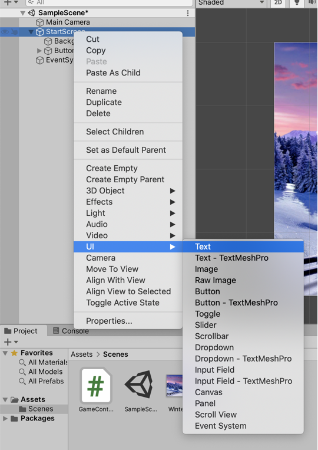
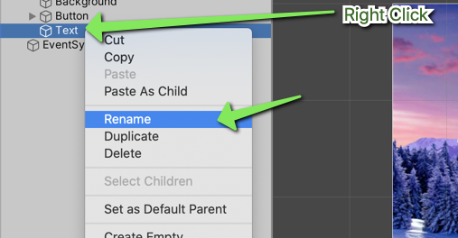
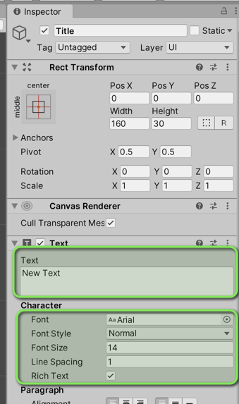
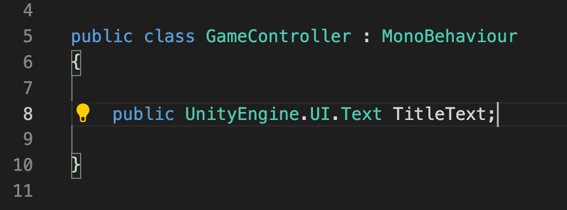
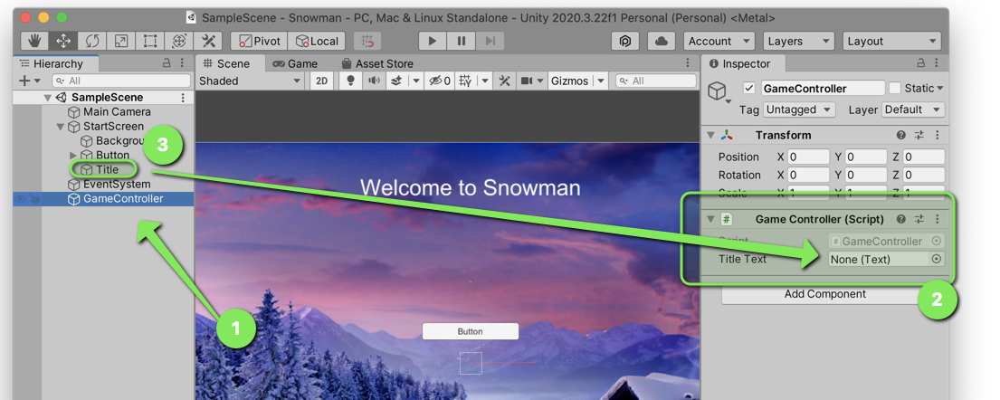
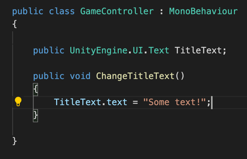
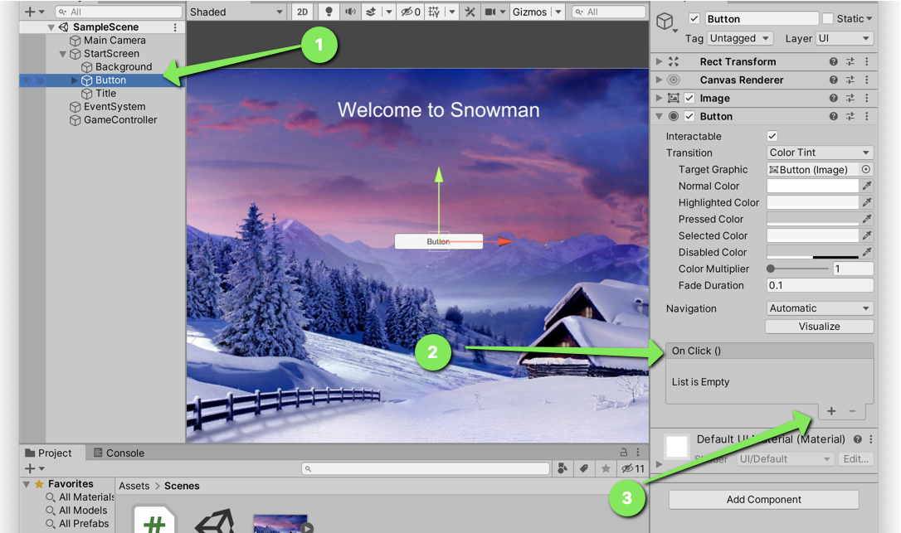
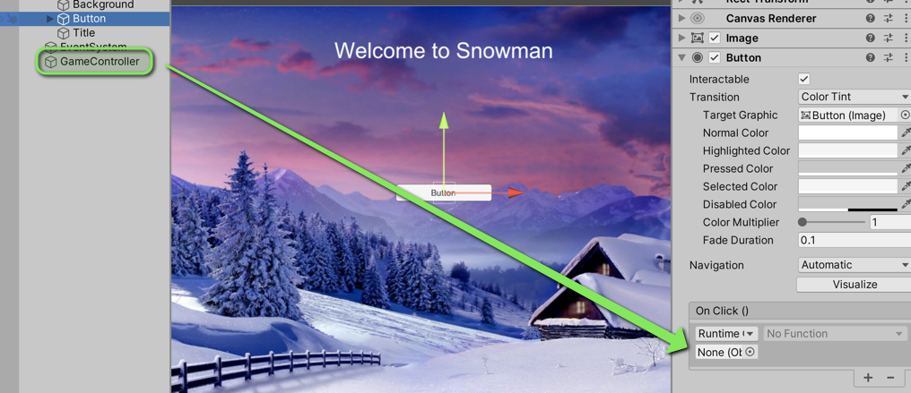
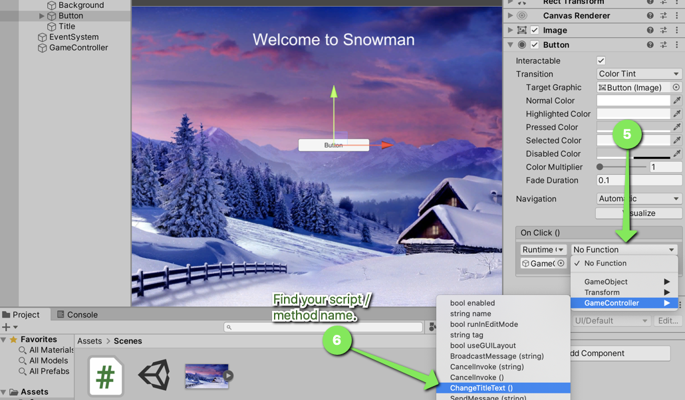

# How to Add a Text Element

## Adding the Element in Unity

1. Right click on a `Canvas` in the Unity Hierarchy
2. Select `UI` > `Text`

3. Rename the element to something more useful than `Text`

4. Set the color in the Inspector
5. Set the font size in the Inspector
6. Set the default text in the Inspector

## Adding a Reference in a Script

To be able to manipulate the text in your script, you need to have a reference. In your script, you must add a `public` member variable of the appropriate type. In this case you need to add:

`public UnityEngine.UI.Text VARIABLE_NAME`

The variable name can be anything BUT it should be named something that is helpful for you to remember.

## Setting the Reference in Unity

Creating a variable doesn't actually set it to be the element you created. You must next assign the reference in the Unity editor.

1. Click on the object in the hierarchy that contains your script. (Probably called GameController).
2. In the Inspector, find the `Game Controller` script.
3. Drag the Text element into the Game Controller script where your public member variable currently says "None".

## Add a Method to Modify the text

Now that we have a reference to the text element in our code, we can modify the text in the code.

1. Create a new method. Name it something related to the action that will be taken.
2. In the method, you can reference your text element by using the variable you created previously.
3. Use the `.text` property of the text element to change the value of the text.

## Update your Buttons OnClick event to call your Method

Finally, we need to tell our button to call our method when it is clicked.

1. Select your button in the hierarchy.
2. Find the OnClick event list in the Inspector.
3. Click the Add button.

4. Drag the object with your script on it into the newly created OnClick event.

5. Click the `Function` drop down on the Event
6. Find your scripts name in the drop down and the name of your method.

## Run your Program

Whew! That's it! You should now be able to cause your code to execute. Click the run button and test your button.