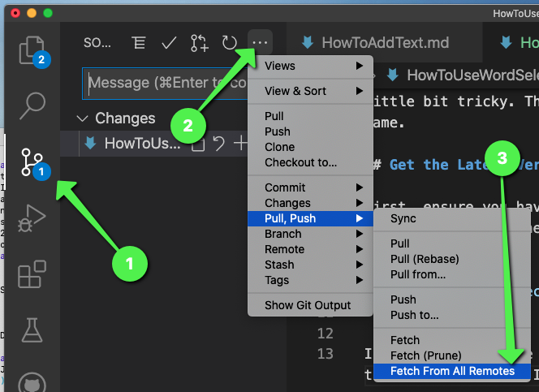
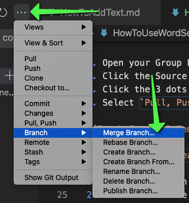

# How To Use Word Selector

In your group project, there is a class called `WordSelector` which will allow you to select random words from a provided dictionary. In Unity, this ends up being a little bit tricky. This document will help you add this feature to your Snowman game.

## Get the Latest Version of WordSelector

First, ensure you have the latest version of WordSelector. The easiest way to do this is to see if the following code compiles in your Snowman Unity project:

```csharp
WordGuesser.WordSelector.LoadFromString("apple banana grape");
```

If you add this code to one of your methods and it compiles, this means you have the latest version and can skip this section.  

If not, you need to update your group project to the latest version.

1. Open your Group Project in VS Code
2. Click the Source Control Tab
3. Click the 3 dots in the top of the Source Control Tab
4. Select `Pull, Push` > `Fetch From All Remotes`



Next, merge `upstream/main` into your own branch.

1. Ensure you're on the branch with your working `WordGame`
2. Click the Source Control Tab
3. Click the 3 dots in the top of the Source Control Tab
4. Select `Merge Branch`
5. When prompted, select `upstream/main` from the branch menu



If all goes well, you will now have the latest version of the `WordSelector`.

Next, you will need to rebuild your `WordGuesser.dll` file and add it to your Unity project.

## Using WordSelector

The Word Selector class allows you to generate random words from a predefined dictionary.

To create a Word Selector, write the following code:

```csharp
WordGuesser.WordSelector mySelector = WordGuesser.WordSelector.LoadFromString("apple banana grape");
```

The code above creates a variable called `mySelector` which stores a `WordSelector` which has 3 words in it `apple`, `banana`, and `grape`. You can simply add words to this list by modifying the string.

To generate a random word, you would then use the following code:

```csharp
string randomWord = mySelector.GetWord();
```

The code above will randomly select a word from the `WordSelector` and return it. Finally, it will assign the returned string to the variable `randomWord`.

Doing this much would be sufficient enough to satisfy the requirement for the Advanced feature.

## Selecting a Random Word from a file

In the original `Snowman` project, there is a file called `words.txt`. This file contains 58,000 words. You may use it to generate a large number of words for your game. However, loading this file in a Unity project is a little tricky.

1. First, you must create a folder called `Resources` in your `Assets` folder. If you want to load files in your code, they need to be inside of this folder.
2. Place the `words.txt` file in this folder.
3. In your code, you can load the `words.txt` file by writing the following code:

```csharp
TextAsset wordFile = UnityEngine.Resources.Load<TextAsset>("words");
```

The code above looks in the `Resources` folder for a resource called `words`. It then tries to load it as a `TextAsset`. If it is found, the value is stored in `wordFile`.

The `TextAsset` class isn't actually a string. However, it contains a `text` field which returns a string of the contents of the file.

4. Use `wordFile.text` as an argument to `WordSelector.LoadFromString()` to generate a `WordSelector` with all of the words.
5. Pass the resulting word into `WordGame`'s constructor

The final code should look something like this:

```csharp
TextAsset wordFile = UnityEngine.Resources.Load<TextAsset>("words");
WordGuesser.WordSelector mySelector = WordGuesser.WordSelector.LoadFromString(wordFile.text);
string randomWord = mySelector.GetWord();
this.guessingGame = new WordGame(randomWord, 5);
```

Best of luck!