# Snowman

In this project, you will implement an interface for creating a Word Guessing
game. Then, using that library, you will implement a Guessing Game called
"Snowman" in Unity.

This project will count as 2 grades: 

* The first part, Milestone 1, 2, and 3 will be completed in a group of 2 or 3
  students. This will be your first grade.
* The second part, Milestones 4, and 5 must be completed individually. This
  will be your second grade.

- [Snowman](#snowman)
  - [Required Software](#required-software)
    - [.NET Core Test Explorer](#net-core-test-explorer)
    - [Markdown All in One](#markdown-all-in-one)
    - [Unity 2020.3.21f / Unity Hub](#unity-2020321f--unity-hub)
  - [Project Setup](#project-setup)
    - [Fork Repository](#fork-repository)
    - [Manage Access](#manage-access)
    - [Clone Repository](#clone-repository)
  - [Team work flow](#team-work-flow)
    - [What is a Branch](#what-is-a-branch)
    - [Disallow committing to main branch](#disallow-committing-to-main-branch)
    - [Creating a Branch](#creating-a-branch)
    - [Create a Pull Request](#create-a-pull-request)
    - [Merge a Pull Request](#merge-a-pull-request)
    - [Resolving Conflicts](#resolving-conflicts)
    - [Merging Main into your Branch](#merging-main-into-your-branch)
  - [Create a Feedback Pull Request](#create-a-feedback-pull-request)
  - [Milestone 1](#milestone-1)
    - [Task List](#task-list)
    - [Getting Started](#getting-started)
    - [Deliverable](#deliverable)
  - [Milestone 2](#milestone-2)
    - [Task List](#task-list-1)
    - [Getting Started](#getting-started-1)
    - [Testing Milestone 2](#testing-milestone-2)
    - [Deliverable](#deliverable-1)
  - [Milestone 3](#milestone-3)
    - [Deliverable](#deliverable-2)
  - [Milestone 4](#milestone-4)
  - [Milestone 5](#milestone-5)

## Required Software

### .NET Core Test Explorer

This plugin allows you to quickly run C# Unit tests inside VS Code.

Get it from the VS Code Market Place:
[LINK](https://marketplace.visualstudio.com/items?itemName=formulahendry.dotnet-test-explorer)

### Markdown All in One

This plugin adds a bunch of nice features for writing Markdown.

Get it from the VS Code Market Place:
[LINK](https://marketplace.visualstudio.com/items?itemName=yzhang.markdown-all-in-one)

### Unity 2020.3.21f / Unity Hub

You should download an install Unity Hub and Unity 2020.3.21f as homework.

Coming soon: A video on completing the Unity installation

## Project Setup

### Fork Repository

For previous projects, you have signed up for the project using GitHub
classroom. This is not a normal work flow in the software development world. For
this project, you will be creating a forked repository. A forked repository can
be thought of a copy of the repository that contains the entire history of the
project that can later be merged back together.

To start out, 1 member from your group should fork the main repository.

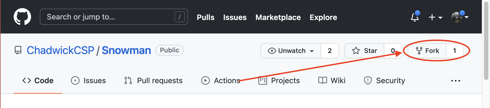

### Manage Access

After the fork has been created. The member who forked it should update the
repository so that each member of the group can access it.

1. Click Settings

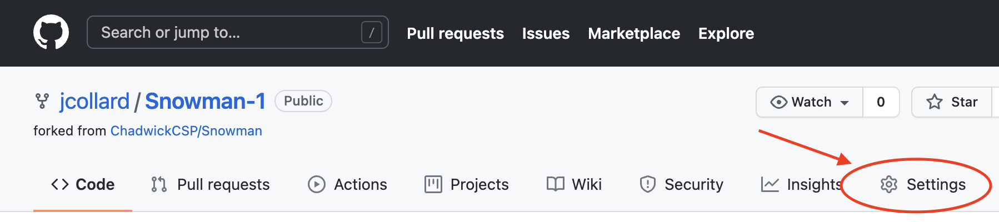

2. Rename your repository to be `snowman-username1-username2-username3`.
    * For example, Mx. Collard (jcollard) and Mr. DeVaughn-Brown (jd12) would
      rename their repository: `snowman-jcollard-jd12`

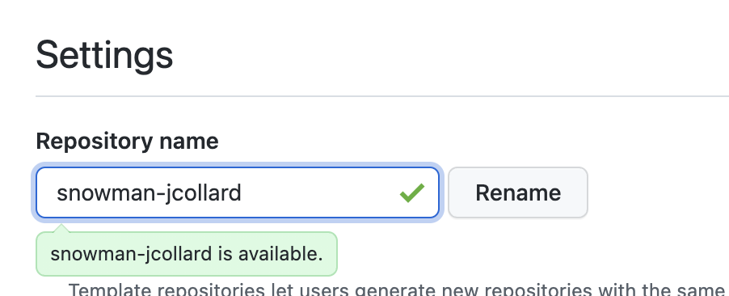

3. Click Manage Access

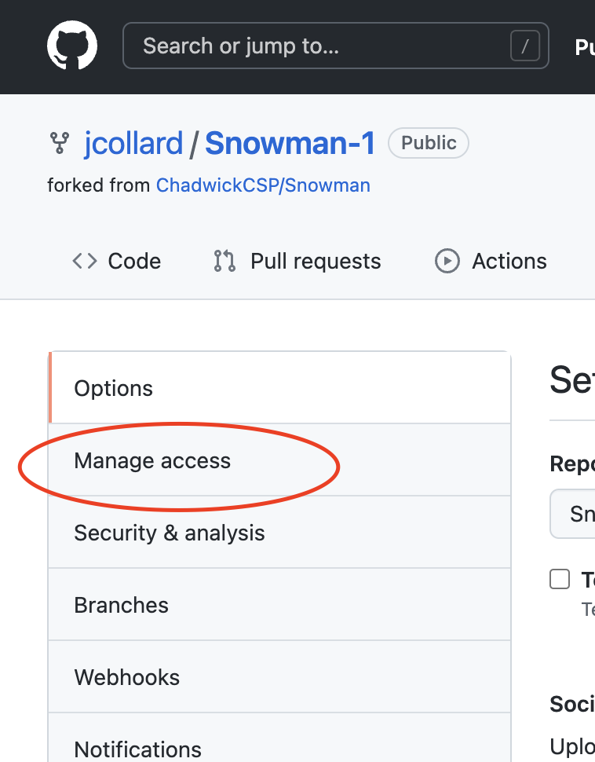

4. Add People

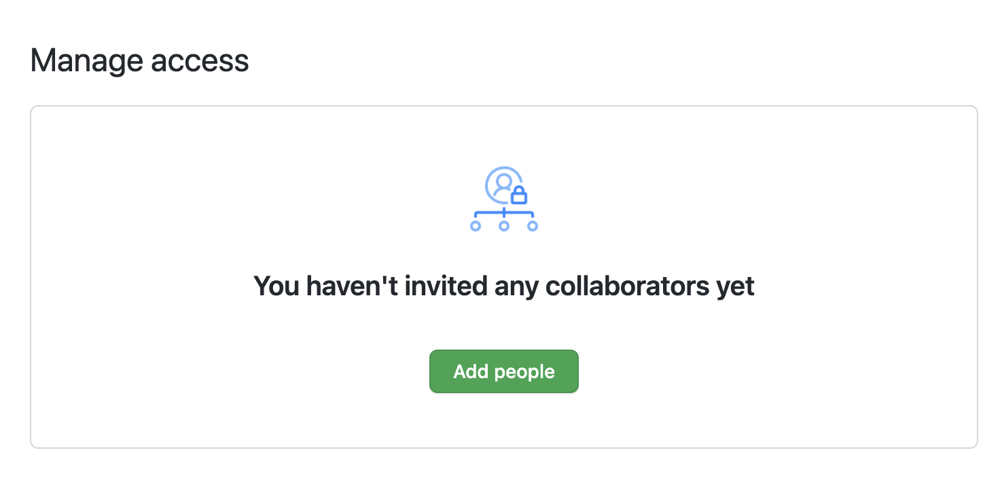

5. Add `jcollard` as well as your other group members. This will be their GitHub
   username.

6. Each member will receive an email with the invitation that they will need to
   accept.

### Clone Repository

Each person should now clone the repository to their computer. The name of the
repository will be prefixed with the username of the member who forked the
repository. For example, Mx. Collard's fork is called
`jcollard/snowman-jcollard`.

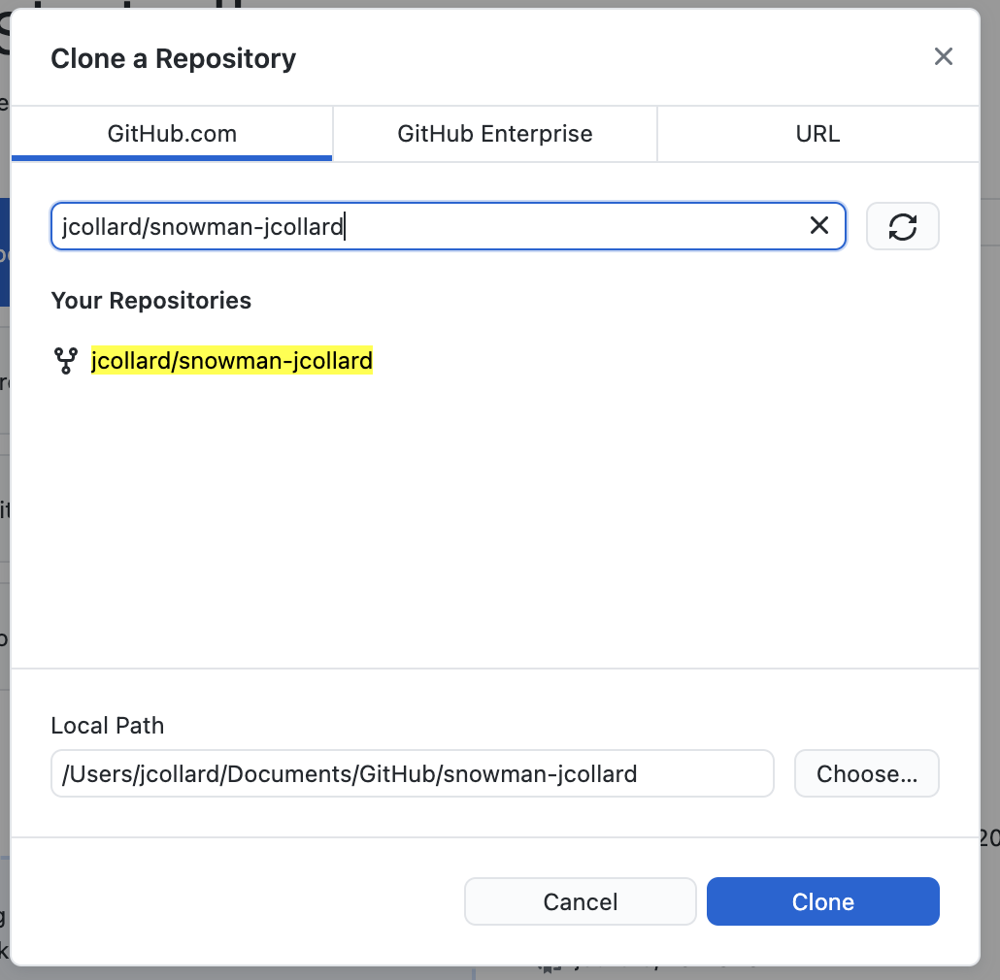

## Team work flow

For the first two milestones of this project, you and your group members will be
working on the project simultaneously. This can cause issues if you are
modifying the same files at the same time. Git is a powerful collaboration tool
that attempts to make this easier.

### What is a Branch

A branch is a copy of the repository that allows for code to be edited in
isolation, tested, and then either combined or discarded depending on the
results. 

### Disallow committing to main branch

Never commit to the main branch! The main branch should always contain the most
recent, agreed upon project. Committing directly to the main branch can cause
major issues for your whole team. The most common iss a conflict if two people
are editing the same file at the same time.

You should **ALWAYS** work on a separate branch and later have your work merged
via a pull requests when you're ready to combine your work.

To help prevent this from happening, you can modify your repository to not
accept pushes to the main branch:

1. Go to settings.
2. Select Branches

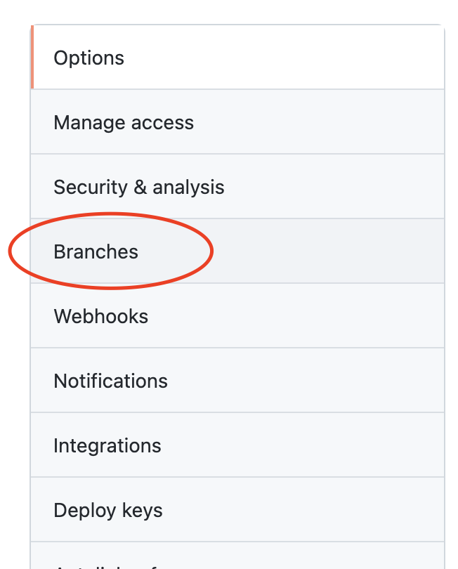

3. Under Branch Protection Rules, click `Add Rule`

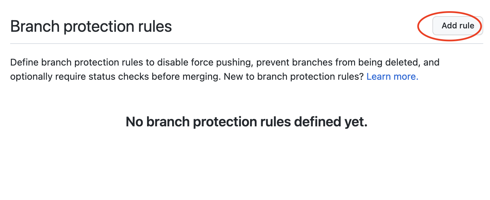

4. Type `main` into the `Branch pattern`
5. Select `Require a pull request before merging`

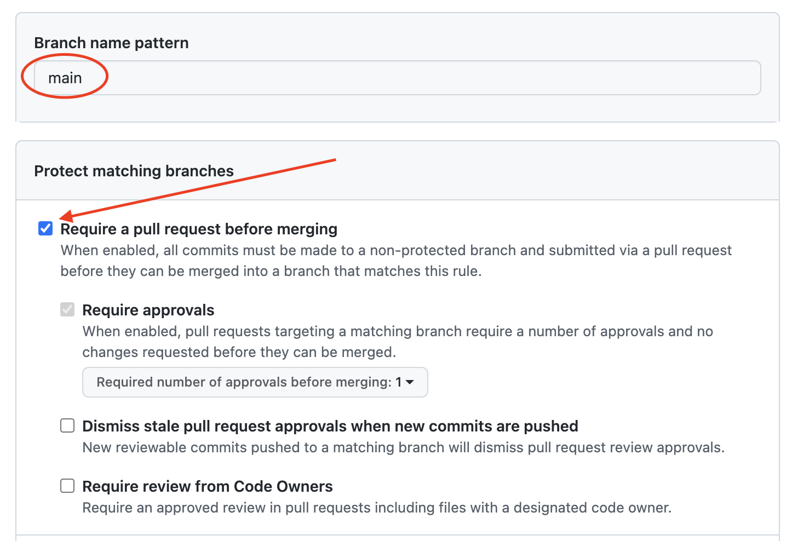

6. Scroll to the bottom and select `Create`

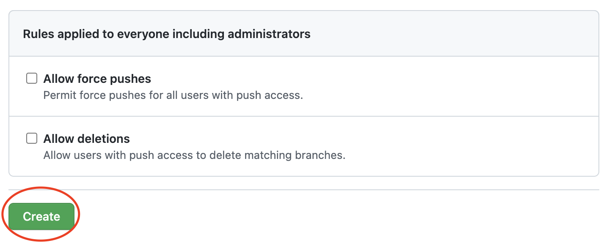

Congratulations! It is now not possible to push directly to the main branch.

### Creating a Branch

For this project, each group member will have their own branch.

Create a branch that matches your name. This is the branch where you will do all
of your own work.

1. Click on the source control icon in VS Code

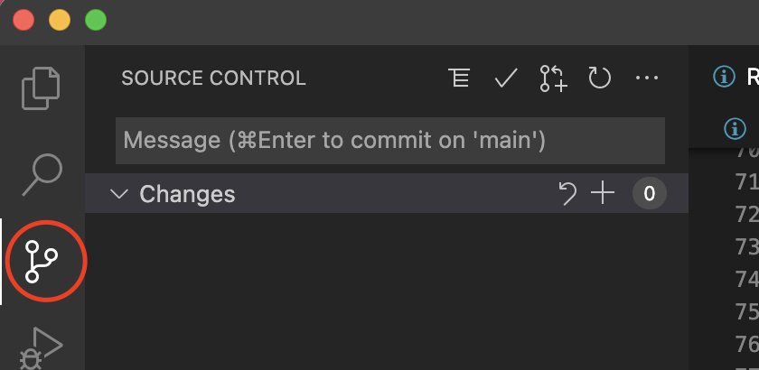

2. Select the `...` Menu > Branch > Create Branch ...

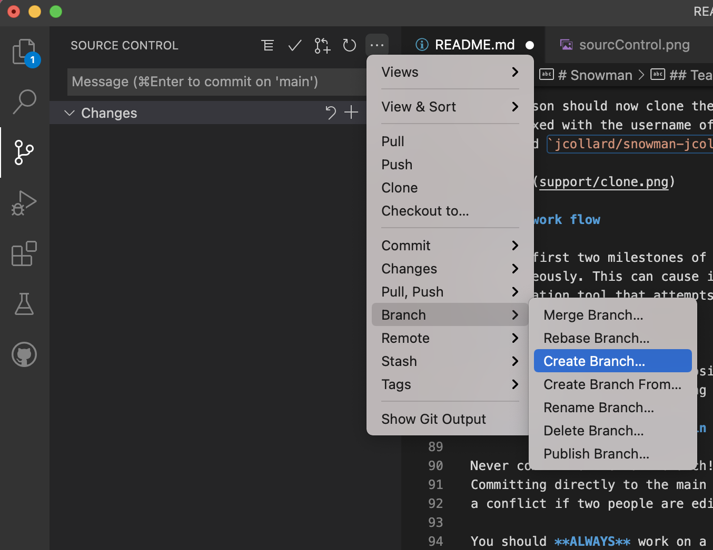

3. Your branch name should be the first part of your email address. For example,
   `jcollard`
    * **Do not click Publish Changes yet!**

4. Add your name to the `Authors` Section of the WordGuesser/README.md document.
   * Note: Only add your individual name, do not add your entire teams name.

5. Commit your change.

6. Click Publish Changes. If you're asked, select `origin`.

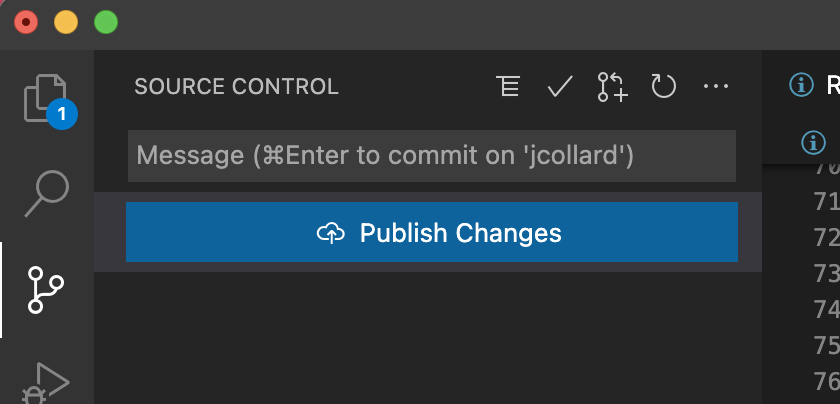

### Create a Pull Request

At this point, your changes are local to your branch. That is, your name is not
visible on any other branch.

To combine work together using git, we perform a merge. Typically, this is done
using a Pull Request. This is a feature that GitHub provides. For now, we will
create a Pull Request using GitHubs interface (note: you can also do this
directly in VS Code).

1. Go to your group's project on GitHub.
2. Click the `Pull Requests` tab

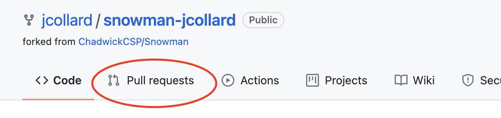

3. Click `New Pull Request`

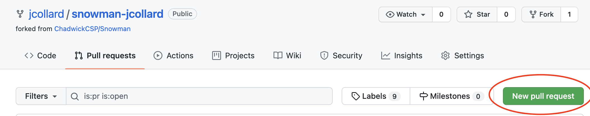

4. Make sure the target repo on the left is your project.

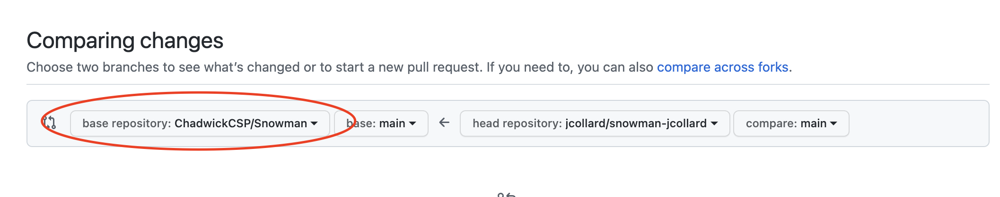

5. Select that you want to merge to `main` from `your-branch`

6. Click `Create Pull Request`

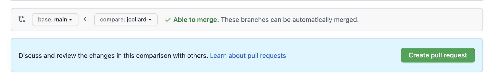

7. Click Add Reviewer and add your group members to review your Pull Request

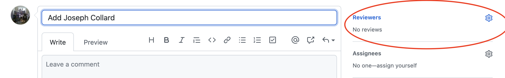

8. Click `Create Pull Request`

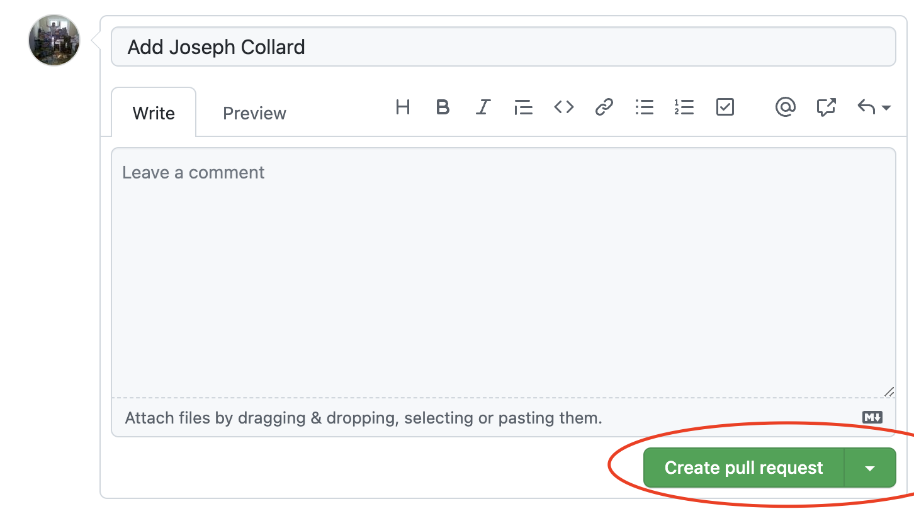

You're now ready for your group members to review your work!

### Merge a Pull Request

Now, it is up to you to review your group members work and merge their work into
the main branch. After everyone has created a Pull Request:

1. Go to the Pull Requests tab
2. Open one of your group members Pull Requests
3. Click on `Files Changed`

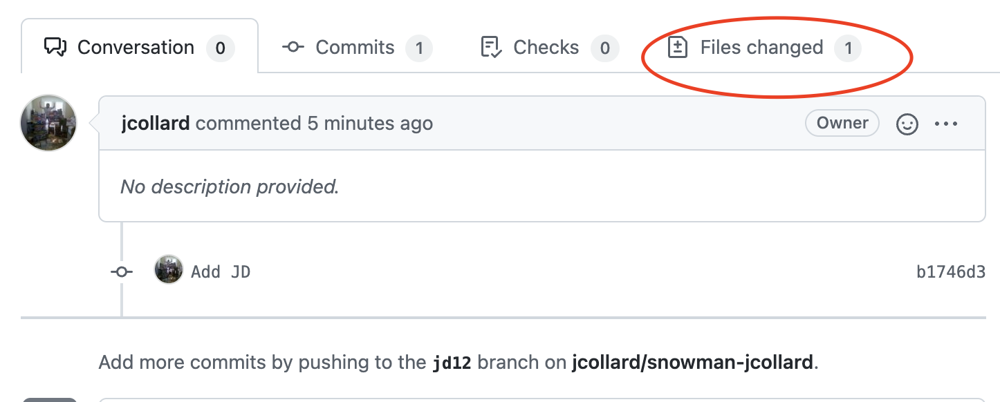

This page shows all of the changes that the person made. You can add comments
directly on each line of the changes. For this change, you're simply going to
add a simple review.

4. Add a Review by clicking `Review Changes`

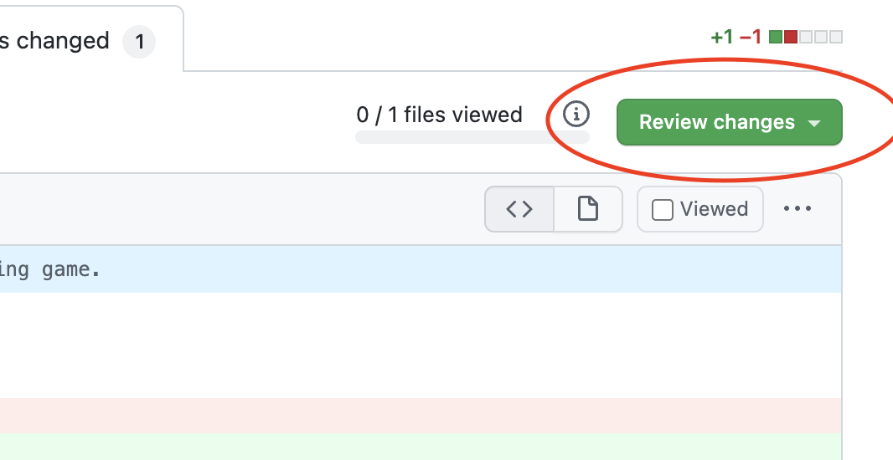

5. Add a message, "Looks good to me!" or "lgtm!" for short. Select `Approve`.
   Then click `Submit Review`

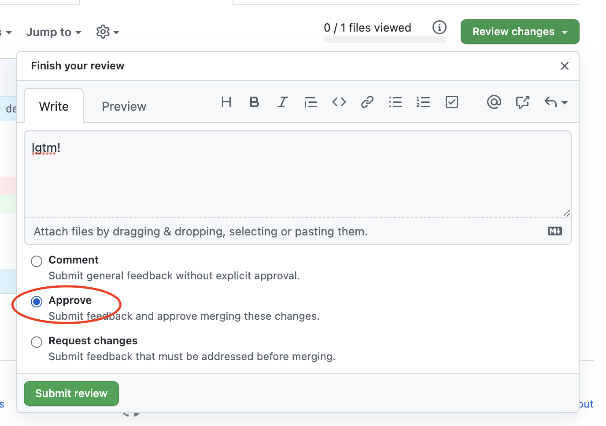

Your review is now added to the Pull Request. This also, by approving the pull
request, the `Merge` button is now green.   
   
6. Click `Merge Pull Request`. Then click `Confirm merge`
   * If someone else merged before you, you will now have a conflict. This
     happens when multiple people modify the same line of a file like we did
     when adding in our author names. We will show how to resolve this in the
     next section.
7. Do NOT click the `Delete Branch` button. For this project, you will continue
   to use your individual branches to make your changes.

### Resolving Conflicts

In the previous step, both group members modified the same file AND the same
line. Normally, git is pretty good at merging changes to the same file as long
as they are not on the same section of code. In this case, git needs a little
help to resolve the conflict. The simplest way to resolve this is to merge the
new main branch into your branch in VS Code.

1. Open your project in VS Code

First we need to get the latest version of the main branch.

2. Click the branch icon in the bottom left of VS Code

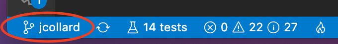

3. When prompted, select `main`

4. Next to the `main` branch, you will see that it shows there are changes that
   need to be pulled (the number on the left). To `sync` your project, click
   this button.


If prompted, click `Ok`. Your main branch is now synced!

5. Switch back to your branch by clicking on the branch icon again and selecting
   your branch.

6. Next, we will merge the changes from `main` to your branch. Go to the Source
   Control tab.


7. Select the `...` menu > Branch > Merge Branch

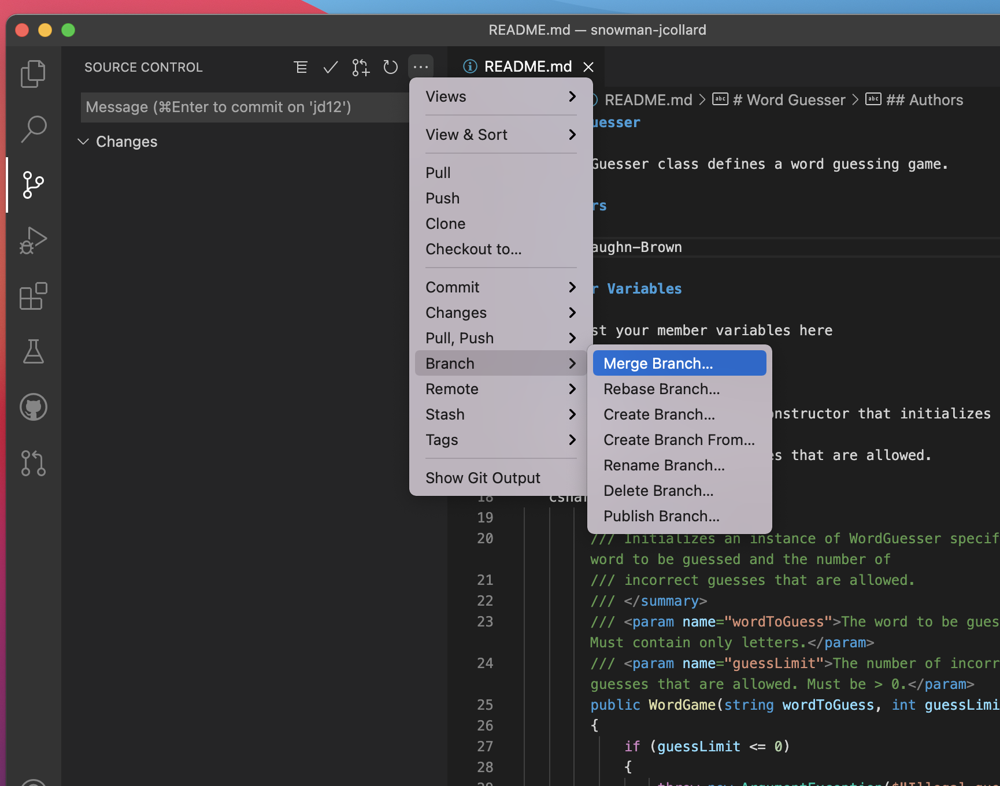

8. When prompted select `main`

You should see a Merge conflict open. For this conflict, we want to accept both
changes.

9. Select `Accept Both Changes`

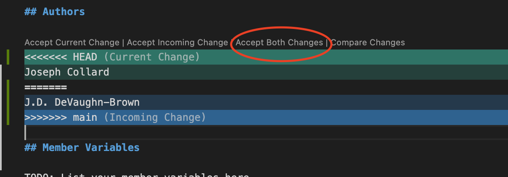

10. Save your file. Commit and Push

11. Return to your Pull Request and finish the merge.

### Merging Main into your Branch

Throughout your project, you should merge any changes from the main branch into
your branch. This will keep it up to date with your group members:

1. Open your project in VS Code

First we need to get the latest version of the main branch.

2. Click the branch icon in the bottom left of VS Code


3. When prompted, select `main`

4. Next to the `main` branch, you will see that it shows there are changes that
   need to be pulled (the number on the left). To `sync` your project, click
   this button.


If prompted, click `Ok`. Your main branch is now synced!

5. Switch back to your branch by clicking on the branch icon again and selecting
   your branch.

6. Next, we will merge the changes from `main` to your branch. Go to the Source
   Control tab.


7. Select the `...` menu > Branch > Merge Branch


8. When prompted select `main`

9. If necessary, resolve any merge conflicts.

## Create a Feedback Pull Request

Create a pull request from your `main` branch to the `ChadwickCSP/main` branch.
Add Mx. Collard as a reviewer.

This is where you will receive feedback from Mx. Collard.

## Milestone 1

* E Period Due: Wednesday Nov. 3rd @ 11:59 PM 
* C Period Due: Thursday Nov. 4th @ 11:59 PM

### Task List

- [ ] Review Design Document located at `WordGuesser/README.md`
- [ ] Review Diagrams in `diagrams` folder
- [ ] Decide who will complete each diagram
- [ ] As a team, complete these methods:
- [ ] IsGameWon()
- [ ] IsGameOver()
- [ ] GetIncorrectGuesses()
- [ ] GetGuessLimit()
- [ ] CheckGuess(string guess)
- [ ] CountLetter(char guess)
- [ ] GetGuessedLetters()
- [ ] GetFullWord()
- [ ] GetWord()
- [ ] Complete all TODOs on the design document

For this milestone, you will complete the design document for a word guessing
game library. You must work in a group of 2 or 3 people for this milestone.

### Getting Started

There are 9 flowcharts that need to be completed. Several of them are quite
simple to complete. For a group of 2 people, I recommend completing the diagrams
in `WordGamePart1` together. Then, dividing the work up for each person to
complete one of `WordGamePart2` or `WordGamePart3`.

A `StringAnalyzer` class with 4 methods has been provided to help you think through
these methods. This class is located in `WordGuesser/src/Examples/StringAnalyzer.cs`.
Additionally, a design document with flowcharts of the 4 methods has been provided
here: [String Analyzer](WordGuesser/src/Examples/README.md)

When you're finished, you should export the completed flowcharts as PNGs and add
them to the `WordGuesser/README.md` file.

### Deliverable

To submit Milestone 1, you should complete all of the flowcharts listed above as
well as updating the `WordGuesser/README.md` file to contain PNG images of the
finished flowcharts. Finally, you should complete all of the TODOs on your
design document.

Finally, all of the work should be merged to your `main` branch and a tag called
`milestone-1` should be created.

If you later decide you would like to change the commit for milestone-1 you may
create additional tags with a version number. For example, milestone-1-v2 or
milestone-1-v3. For final grading, the milestone-1 tag with the greatest version
number will be used. After creating your tag, don't forget to push it to GitHub
and verify it is available online.

## Milestone 2

* E Period Due: Wednesday Nov 10th @ 11:59 PM 
* C Period Due: Thursday Nov 11th @ 11:59 PM

For this milestone, you will implement the IWordGame interface using the
flowcharts from Milestone 1. You must work in a group of 2 or 3 people for this
milestone.

### Task List

- [ ] Create `WordGame.cs`
- [ ] Create a class `WordGame` that implements `IWordGame`
- [ ] Add a Constructor for `WordGame`
- [ ] Update `Config.cs` to use `WordGame`
- [ ] Implement each method in `IWordGame`:
- [ ] IsGameWon()
- [ ] IsGameOver()
- [ ] GetIncorrectGuesses()
- [ ] GetGuessLimit()
- [ ] CheckGuess(string guess)
- [ ] CountLetter(char guess)
- [ ] GetGuessedLetters()
- [ ] GetFullWord()
- [ ] GetWord()

### Getting Started

Coming Soon: VIDEO

1. On one members branch, create a file called `WordGame.cs` within the
   `WordGuesser/src/WordGame` folder.
2. Add the following starter code to the file:

```csharp
namespace WordGuesser
{
    public class WordGame : IWordGame
    {

    }
}
```

3. Click on `IWordGame`, click the lightbulb icon that appears on the left, and
   select `Implement Interface`

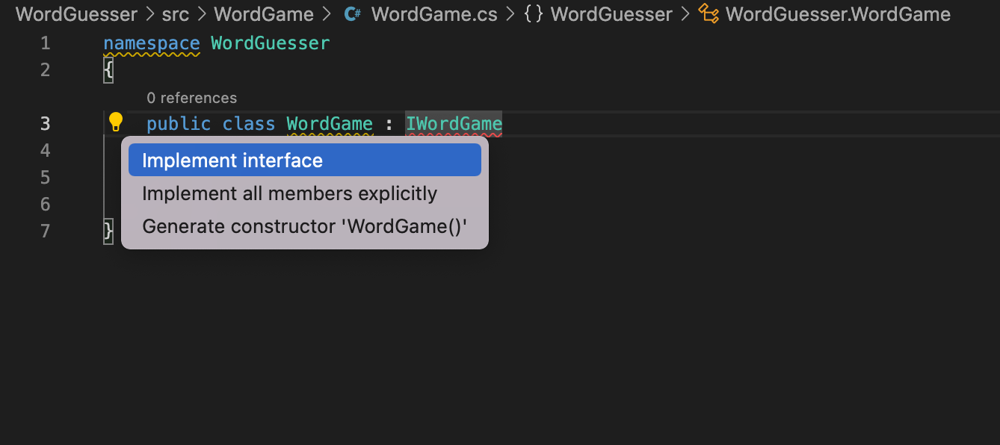

4. Add the member variables you specified during Milestone 1.
5. Add the constructor from Milestone 1 and update it to initialize your
   variables appropriately.
6. Update `Config.cs` to use your constructor

### Testing Milestone 2

For Milestone 2, you have been provided with Unit Tests that are designed to
help you test your code. To run these,

1. Select the Test icon in VS Code.

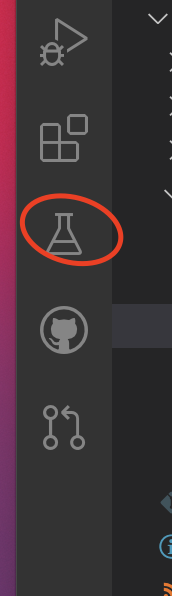

2. Click the Run All button at the top of the Testing page

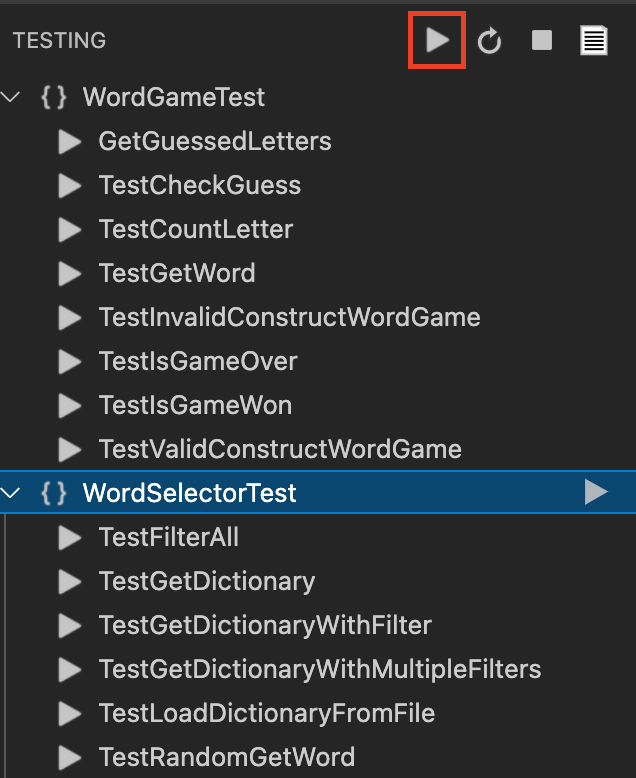

3. Initially, all of the tests will fail.

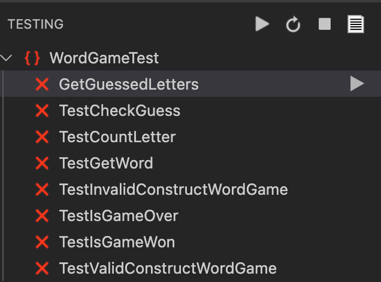

4. However, as you complete each method more tests should begin to pass. To
   receive full points for Computational Thinking, all tests should pass.

### Deliverable

To submit Milestone 2, you should finish your implementation of the `IWordGame`
interface and pass all tests.

Finally, all of the work should be merged to your `main` branch and a tag called
`milestone-2` should be created.

If you later decide you would like to change the commit for milestone-2 you may
create additional tags with a version number. For example, milestone-2-v2 or
milestone-2-v3. For final grading, the milestone-2 tag with the greatest version
number will be used. After creating your tag, don't forget to push it to GitHub
and verify it is available online.

## Milestone 3

Due: Monday November 15th

For this Milestone, your group should finish the `WrittenResponse/README.md` file.
For full credit, each member of the group should complete at least 2 sections. You may
however work on this section together.

### Deliverable

To submit Milestone 3, you should finish the `WrittenResponse/README.md` file.

Finally, all of the work should be merged to your `main` branch and a tag called
`milestone-3` should be created.

If you later decide you would like to change the commit for milestone-3 you may
create additional tags with a version number. For example, milestone-3-v2 or
milestone-3-v3. For final grading, the milestone-3 tag with the greatest version
number will be used. After creating your tag, don't forget to push it to GitHub
and verify it is available online.

## Milestone 4

Due: Monday November 15th

For the final part of the project, you will use the WordGuesser library your group
made in Milestone 2 to control the logic of a guessing game using the software framework
Unity.

To do this, you must download and install Unity. For this project, we will be using
Unity 2020.3. To do this, first you will install Unity Hub.

Window: [LINK](https://unity3d.com/get-unity/download)
Mac: [LINK](https://drive.google.com/file/d/1PHnpMFkHKqsxEiO2TEJUjf58BP3tVZNY/view?usp=sharing)

Unity Setup Instructions: [LINK](UnitySetup/README.md)

## Milestone 5

Complete the Snowman Game Coming Soon!

Coming Soon!