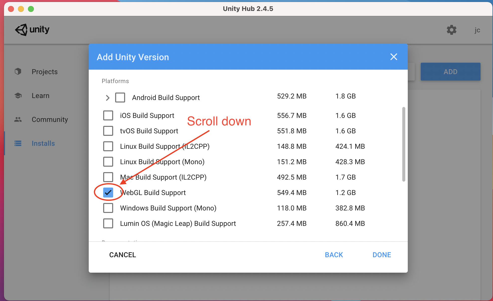

# Unity Setup

These instructions were written on Mac Big Sur. On Windows / other versions of Mac, this process
may be slightly different. Do your best to get through it and ask questions on Piazza if you need help.

1. Install Unity Hub
   

2. Launch Unity Hub

3. You may be prompted to use Unity Hub 3.0. Do not select yes. Select Maybe Later or No.
   

4. You need to login (or create) a Unity account. To do this, click the icon in the top right of Unity Hub. Then click "Sign in"

5. If prompted, select Accept Cookies. You may not be prompted.

6. You should login with your Chadwick email address. To do this, authenticate with Google by clicking the Google Icon. You may need to scroll down to find it.

7. Login with your Chadwick Email Address. 
   

8. You will be prompted that Unity wants access to your Google Account. Scroll down and click Allow. You may be prompted to sign-up for a Unity account. If so, follow the instructions on Unity's website.

9. After you're logged in, Unity Hub will show your initials in the top right. Click your initials. Then, click "Manage License"

10. Click Activate New License.

11. Select Unity Personal. Then, select "I don't use Unity in a professional capacity"

12. After a moment, a new license will appear. Click the back arrow in the top left corner.
    

13. Click Installs on the left menu.
    

14. Select Add from the Installs screen in the top right.
    

15. When prompted to select a version, you should select a version that starts with `2020.3` As of writing this, the version is `2020.3.22f1`
    

16. When prompted, uncheck the box that says `Visual Studio for Mac`. You do not need to install this.
    

17. Scroll down and check the box for `WebGL Build Support`
    

18. Finally, click Done. A box showing your selected version of Unity will appear. It will take several minutes to install. It is downloading a large file. 
