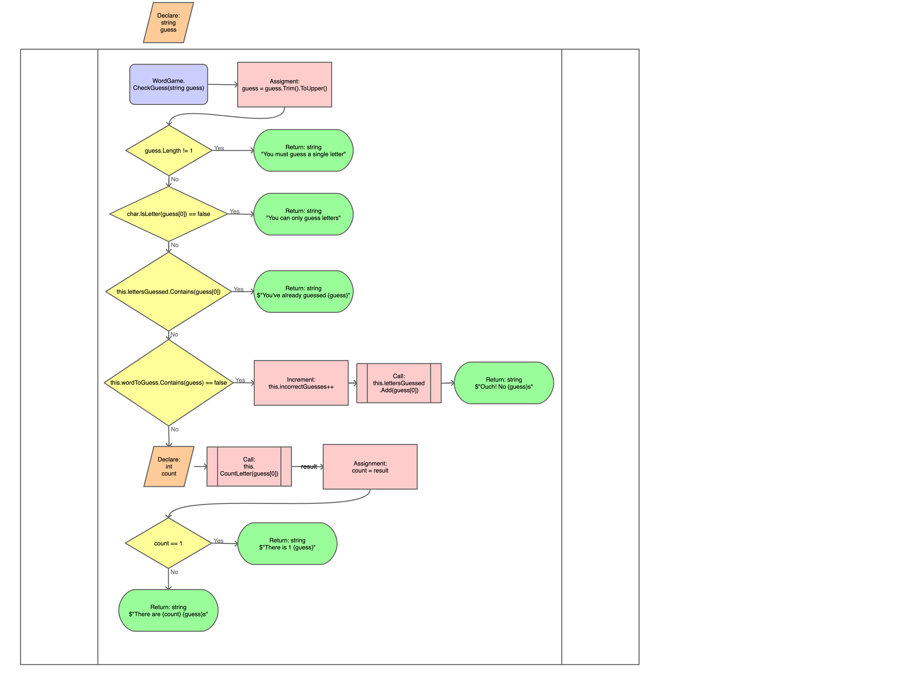

# Word Guesser

The WordGuesser class defines a word guessing game.

## Authors

Zoe Stephens 
Kailey Freedman
Gretchen Deutsch 

## Member Variables

List<char> guessedLetters;
int incorrectGuessCount;
int guessLimit;
string wordToGuess;

## Constructors

The WordGuesser class has a constructor that initializes the word to be guessed and specifies
the number of incorrect guesses that are allowed.

```csharp
        /// <summary>
        /// Initializes an instance of WordGuesser specifying the word to be guessed and the number of
        /// incorrect guesses that are allowed.
        /// </summary>
        /// <param name="wordToGuess">The word to be guessed. Must contain only letters.</param>
        /// <param name="guessLimit">The number of incorrect guesses that are allowed. Must be > 0.</param>
        public WordGame(string wordToGuess, int guessLimit)
        {
            if (guessLimit <= 0)
            {
                throw new ArgumentException($"Illegal guessLimit '{guessLimit}'. The guess limit must be greater than 0.");
            }

            foreach (char c in wordToGuess)
            {
                if (char.IsLetter(c) == false)
                {
                    throw new ArgumentException($"Illegal word '{wordToGuess}'. The word must contain only letters.");
                }
            }

            // TODO: Initialize member variables
        }
```

## Methods

### IsGameWon()

This method checks if the game has been won. A game is considered won if all of
the letters in the word to be guessed have been guessed.

.png)

### IsGameOver()

This method checks if the game has been lost. A game is considered lost if the
number of incorrect guesses is greater than or equal to the guess limit.

.png)

### GetIncorrectGuesses()

This method returns the number of incorrect guesses that have been made.

.png)

### GetGuessLimit()

This method returns the number of incorrect guesses that can be made before the
game is over.

.png)

### CheckGuess(string guess)

Checks a users guess and returns a string message informing them of the result
and updating the game state as necessary.
        
1. The guess is sanitized such that the case, preceding, and trailing white
   space are ignored.
2. If the length of the sanitized input is not 1 character, returns "You must
   guess a single letter".
3. If the character is not a letter, returns "You can only guess letters"
4. If the letter guessed has been previously guessed, returns "You've already
   guessed {guess}"
5. If the letter has not been previously guessed, it is added to the list of
   guessed letters.
6. If the letter is not part of the word to be guessed, the number of incorrect
   guesses increments by 1 and then returns "Ouch! No {guess}s"
7. If the guessed letter appears in the word once, returns "There is 1 {guess}".
8. If the letter is correct and appears multiple times, returns "There are
   {count} {guess}s".

 

### CountLetter(char guess)

Counts the number of times the specified character appears in the word to be
guessed. The case of the letter specified is ignored.

Algorithm:

1. Check that `guess` is a letter. If it is not a letter, throw an `ArgumentException`.
2. Sanitize the `guess` character by making it uppercase.
3. Initialize an integer to count the number of appearances.
4. Iterate through every character in the word being guessed.
   * If it is the guess, increment the count.
5. After checking every letter, return the count.

.png)

### GetGuessedLetters()

Returns a string containing each letter that has been guessed in the order that
they were guessed.

Algorithm:

1. Create an empty string that will accumulate the letters that have been guessed.
2. Iterate through every character that has been guessed
   * Append the character to the string
3. Trim the string and return it

.png)

### GetFullWord()

Returns the word that is to be guessed without any missing letters.

.png)
### GetWord()

Returns the word that is to be guessed with each letter that has not yet been
guessed replaced with an underscore.

Algorithm:

1. Create an empty string that will accumulate the word to be displayed.
2. Iterate through every character in the word to be guessed
   * If the letter has been guessed (this.guessedLetters.Contains(c)), append the letter to the string
   * If the letter has not been guessed (else), append an underscore to the string
3. Trim the string and return it.

.png)
