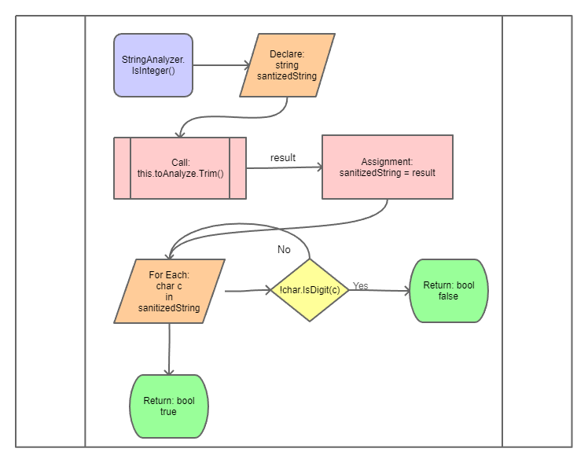
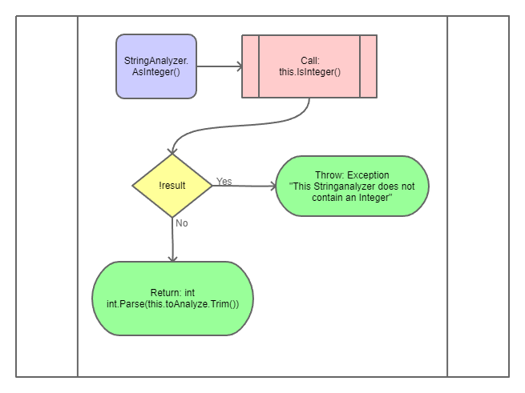
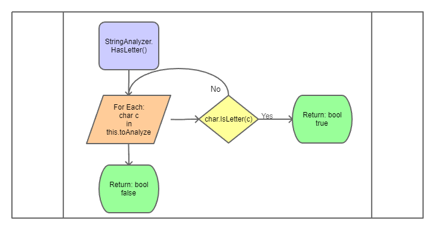
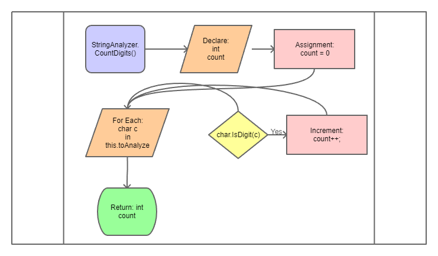

# String Analyzer

The StringAnalyzer class provides methods for analyzing the contents of a string.

## Author

Joseph Collard

## Member Variables

* toAnalyze - This is a string that is analyzed during method calls.

## Constructors

The String Analyzer class has a single constructor which has 1 parameter, the string to be analyzed.

```csharp
        /// <summary>
        /// Initializes an instance of the Stringanalyzer class specifying the string to be analyzed.
        /// </summary>
        /// <param name="toAnalyze">The string to be analyzed.</param>
        public StringAnalyzer(string toAnalyze)
        {
            this.toAnalyze = toAnalyze;
        }
```

## Methods

### IsInteger()

This method checks if the string being analyzed is a non-negative integer. This is accomplished
by first trimming the string, then looping through each character. If any character is not a digit,
this string is not an integer.



### AsInteger()

This method converts the string being analyzed into an integer. If `this.IsInteger()` returns `false`
this method will fail throwing an Exception.



### HasLetter()

This method checks if the string contains any letters. This is accomplished by looping through the string.
If any of the characters in the string are a letter, this method returns true. If all of the characters in this string
are not letters, this method returns false.



### CountDigits()

This method counts the number of digits that appear in this string. This is accomplished by looping through each
character in the string. Each time a digit is found, a counter is incremented. At the end of the method, the total count
is returned.

